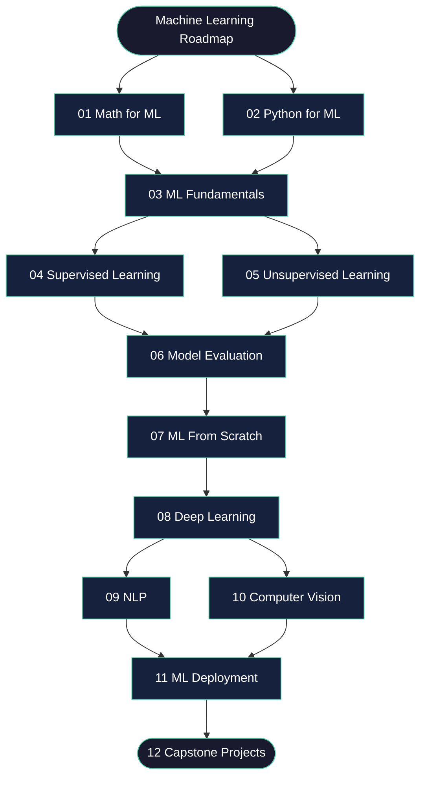

# Machine Learning Roadmap

> My personal ML revision guide — theory, code and projects from scratch to advanced.


---

## About

This is my ML revision repo — built so I actually understand the concepts, not just use them.

Every topic has theory, working code with comments, and a mini project. Anyone learning ML can follow along.

---

## Roadmap



---

## Sections

| # | Section | Topics |
|---|---------|--------|
| 01 | [Math for ML](./01_math_for_ml/) | Linear Algebra · Probability · Calculus |
| 02 | [Python for ML](./02_python_for_ml/) | NumPy · Pandas · Matplotlib |
| 03 | [ML Fundamentals](./03_ml_fundamentals/) | Preprocessing · Feature Engineering · Train Test Split |
| 04 | [Supervised Learning](./04_supervised_learning/) | Regression · Trees · SVM · KNN · Naive Bayes |
| 05 | [Unsupervised Learning](./05_unsupervised_learning/) | KMeans · Hierarchical · PCA · DBSCAN |
| 06 | [Model Evaluation](./06_model_evaluation/) | Confusion Matrix · ROC AUC · Cross Validation |
| 07 | [ML From Scratch](./07_ml_from_scratch/) | Core algorithms without sklearn |
| 08 | [Deep Learning](./08_deep_learning/) | Neural Networks · CNN · RNN · Transfer Learning |
| 09 | [NLP](./09_nlp/) | Transformers · BERT · Word Embeddings · RAG |
| 10 | [Computer Vision](./10_computer_vision/) | OpenCV · Object Detection · Segmentation |
| 11 | [ML Deployment](./11_ml_deployment/) | FastAPI · Streamlit · Docker |
| 12 | [Capstone Projects](./12_capstone_projects/) | End-to-end ML pipelines |

---

## What each notebook contains

```
1. What is this?        — plain English explanation
2. Why it matters       — where it shows up in real ML
3. Theory and math      — concept with visuals
4. Code                 — implemented with comments
5. Visualisation        — plots to build intuition
6. Common mistakes      — what to watch out for
7. Interview questions  — to test understanding
```

---

## Getting Started

```bash
git clone https://github.com/riya1o1/machine-learning-roadmap.git
cd machine-learning-roadmap
pip install -r requirements.txt
jupyter notebook
```


## Contributing

Found an error or have a better explanation? PRs are welcome.
If this helped you, leave a star — it helps others find it.

---

<p align="center">Built in public by <a href="https://github.com/riya1o1">Riya Singh</a></p>
